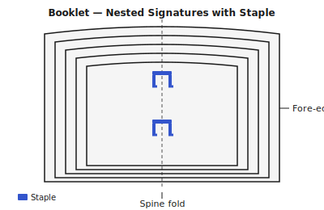

## What is booklet binding? {#overview}

Booklet binding is essentially saddle stitch applied to a compact format — multiple sheets of paper are folded and nested together to form a single signature, then stapled or sewn through the spine fold. The result is a flat, neat booklet.

In Quire, the **Booklet** technique maps to the same imposition group as saddle stitch (Group B) and produces the same sheet layout. The difference is mainly one of intent and scale: booklets are typically smaller-format documents such as instruction leaflets, menus, or event programs.

## When to use this technique {#when-to-use}

Booklet binding is ideal for:

- A5, A6, or half-letter format documents
- Short documents up to about 64 pages
- Products that must lie flat when open
- Quick production runs

## Tools and materials {#tools-materials}

You will need:

1. A **long-arm stapler** if stapling — standard staplers cannot reach the centre fold of larger sheets.
2. A **bone folder** for clean, accurate folds.
3. A **ruler and pencil** for marking hole positions (sewn variant).
4. A **needle and waxed linen thread** for the sewn variant.

Cover stock at 200–300 gsm adds stiffness and a professional look.

## Preparing your pages in Quire {#preparation}

1. Open your PDF and select **Booklet** as the binding technique.
2. Quire checks that the page count is a multiple of 4 and inserts filler pages if needed.
3. Configure your paper size. For an A5 booklet, select A4 as the output paper size (the imposition folds the A4 sheet to produce A5 pages).
4. Add front matter (cover) or rear matter as needed.
5. Export the imposed PDF.

## Printing your sheets {#printing}

Print double-sided with **flip on short edge**. Always print a single test sheet and fold it to verify page order before printing the full run.

## Folding and nesting {#folding}

1. Sort the printed sheets in order.
2. Fold all sheets together in one action, aligning edges carefully.
3. Use a bone folder to sharpen the fold from the centre outward to reduce wrinkling.
4. Verify page order by paging through the folded booklet.

## Binding the booklet {#binding}

### Stapled variant

1. Open the booklet to the centre spread.
2. Mark two staple positions 20 mm from the top and bottom.
3. Staple through all layers at both marks.
4. Close and press flat with a bone folder.

### Sewn variant

1. Open to the centre spread and mark 3–5 holes evenly along the fold.
2. Pierce through all layers with an awl.
3. Sew using the pamphlet-stitch pattern (out at centre, in at top, out at bottom, in at centre again, tie off).

## Tips and common mistakes {#tips}

> **Tip:** For crisp pages, fold with the paper grain running parallel to the spine. Fold against the grain and you will get wrinkles and uneven folds.

> **Tip:** Stack all sheets and fold together in one action rather than individually — the result is better aligned.

> **Warning:** Do not use more than about 16 sheets (64 pages) in a single signature. The fold becomes bulky and the binding loses strength. For longer documents, switch to sewn signatures.
