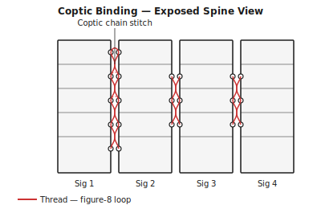
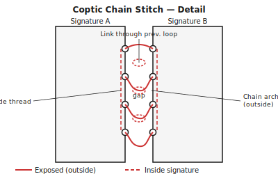

## What is Coptic stitch? {#overview}

Coptic stitch is an ancient binding technique that links signatures directly to each other through looped stitches at the spine. There is no cover case and no spine lining — the sewn spine is fully exposed, revealing a decorative chain of thread links.

The result opens completely flat at any page, making it popular for sketchbooks, journals, and photo albums. It is one of the oldest known bookbinding methods, originating in early Christian Egypt.

## When to use this technique {#when-to-use}

Coptic stitch is ideal for:

- Journals, sketchbooks, and artist's books where flat-opening is essential
- Books where an exposed, decorative spine is desirable
- Projects where the materials and craft are part of the aesthetic
- Medium-length books (64–200 pages or more)

It is not suitable for documents where the spine needs to be labelled or covered, or where the binding must be hidden inside a case.

## Tools and materials {#tools-materials}

1. **Two bookbinding needles** — Coptic stitch is sewn with two needles working simultaneously from opposite ends of the thread.
2. An **awl** for piercing the spine fold of each signature.
3. A **bone folder** for sharp, even folds.
4. **Waxed linen thread** — 18/3 or 25/3 weight. Wax your thread well; it needs to glide through multiple layers without catching.
5. **Cover boards** — rigid binder's board (2–3 mm) or very heavy card. Pierce these with holes to match the signature sewing stations.
6. **Binder's clips** to hold the growing book block steady while sewing.

## Preparing your pages in Quire {#preparation}

1. Open your PDF and select **Coptic** as the binding technique.
2. Set the **signature size**. Four sheets (16 pages) per signature is standard. Thinner signatures lie flatter when open.
3. Quire will calculate the signature count and add completion blanks if needed.
4. Set the paper weight for **creep compensation** if your signatures will be trimmed after sewing.
5. Export the imposed PDF.

## Printing and folding signatures {#printing}

Print double-sided with **flip on short edge**.

1. Sort sheets into signature groups using Quire's imposition marks.
2. Fold each signature individually. Align all edges carefully before bone-folding.
3. Stack signatures in order and press flat.

## Preparing the covers {#covers}

1. Cut two cover boards to the height of the signatures and 3 mm wider (to give a small square on the fore-edge).
2. Mark sewing holes on one cover board using the same template you will use for the signatures — usually 4–8 holes spaced evenly, with the outermost holes 15–20 mm from head and tail.
3. Pierce the holes with an awl through both boards stacked together, so the holes match exactly.
4. If using decorative paper, apply it to the outside of each board with PVA and let dry under weight before piercing.

## Sewing the Coptic stitch {#sewing}

Cut a length of thread roughly five times the height of the spine. Thread both needles (one on each end).

**First signature (onto the front cover):**

1. Hold the front cover and the first signature together, inside facing in.
2. Pass both needles through the first hole from outside, leaving a small tail. Tie the tail inside with a half-hitch around the cover's first stitch.
3. Advance to the next hole: one needle passes out, the other passes in. At each hole, the exiting needle loops through the cover's stitch before re-entering. Continue to the last hole.
4. Tie off to the cover at the last hole.

**Adding subsequent signatures:**

1. Position the next signature on top of the previous one.
2. At each sewing station, one needle passes through the new signature from inside to outside. Before re-entering, the needle loops through the link stitch of the previous signature — this creates the chain link that binds the signatures together.
3. At the head and tail holes, tie a kettle stitch.
4. Continue until all signatures are sewn.

**Attaching the back cover:**

Sew the back cover on in the same way as the first, treating it as a final "signature." The chain links at the spine will run continuously from front cover to back.

## Tips and common mistakes {#tips}

> **Tip:** The sewing tension must be consistent throughout. Pull each stitch firm but not so tight that it cuts through the paper. Inconsistent tension makes the spine uneven.

> **Tip:** Mark all sewing holes with the same card template for every signature and both covers. Even one hole slightly out of position will cause the spine to buckle.

> **Tip:** Use two colours of thread for a decorative effect — the chain links on the exposed spine are clearly visible and a strong thread colour is part of the finished look.

> **Warning:** Coptic stitch relies entirely on the thread for structural integrity. Do not use ordinary sewing thread — it is not strong enough. Use waxed linen bookbinding thread.

> **Warning:** If the first and last signatures are noticeably thinner than the others (due to completion blanks), the covers will not sit evenly. Use Quire's blank distribution to spread extra pages across signatures.
