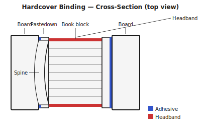

## What is case binding? {#overview}

Case binding is the construction method behind the books you find on library shelves. A sewn book block — assembled exactly as described in the Sewn signatures guide — is glued into a pre-made rigid case constructed from binder's board and cover material.

The case and the book block are made separately, then joined in a step called *casing in*. The endpapers are the structural bridge: one leaf of each endpaper is pasted to the inside of the board (the pastedown), anchoring the book block firmly.

## When to use this technique {#when-to-use}

Hardcover case binding is the right choice for:

- Books that need to survive heavy daily use
- Archival documents, sketchbooks, and reference books
- Any project where a professional, gift-quality finish is wanted
- Long documents that have already been sewn as signatures

It is not worth the effort for short-run documents you will discard after one use. For those, saddle stitch is faster and good enough.

## Tools and materials {#tools-materials}

1. All the tools and materials from **Sewn signatures** — the book block is made first.
2. **Binder's board** — 2 mm for most books, 2.5–3 mm for larger formats. Greyboard is acceptable; acid-free board is better for archival work.
3. **Book cloth or cover paper** — book cloth (a starch- or acrylic-backed fabric) is the most durable. Decorative papers work but need a paste-paper barrier coat if they are thin and porous (to prevent PVA strike-through).
4. **Endpaper stock** — 120–160 gsm. Fold in half to make the hinge. The grain must run parallel to the spine.
5. **PVA glue** — use a slow-tack PVA (or 50/50 PVA/paste mix) for covering boards, which gives you time to adjust before it sets.
6. **Mull or super** — a woven gauze glued to the spine and overhanging each side to bond into the case.
7. **Pressing boards** — flat, smooth boards slightly larger than the book. Essential for getting a flat, even result.

## Preparing your pages in Quire {#preparation}

1. Open your PDF and select **Hardcover** as the binding technique.
2. Set the **signature size**. Four sheets (16 pages) per signature is a reliable default. Reduce to three sheets for heavier paper stocks.
3. Configure **creep compensation** by entering the paper weight. Quire will shift outer pages outward so the fore-edge aligns after trimming.
4. Add **endpapers** at the front and rear. These will be printed on heavier stock and attached to the boards during casing in. Quire will flag if your endpaper pages are not on a matching stock setting.
5. Export the imposed PDF.

## Making the book block {#book-block}

Follow the **Sewn signatures** guide to sew the book block. Then:

1. Press the sewn block under weight for at least one hour.
2. Apply a thin, even coat of PVA to the spine. Work it into the threads with your finger. Let dry.
3. Apply a second coat of PVA and press on the mull, leaving 20–30 mm of overhang on each side. Smooth out any bubbles. Let dry fully.
4. Trim the head, tail, and fore-edge if needed for a square, even block.
5. Optionally, attach **headbands** at the head and tail of the spine. Apply a strip of PVA and press the headband in place. Let dry.

## Building the case {#case}

1. Measure the book block carefully: height, width, and spine thickness.
2. Cut **two boards** the same height as the book block and 3 mm narrower than the width (this gives a 3 mm square — the overhang of the board beyond the pages — on three sides).
3. Cut the **spine piece** from thick card or a narrow strip of board, the same height as the boards and exactly the width of the spine.
4. Cut the **cover material** (cloth or paper) to the board area plus 20 mm overhang on all four sides.
5. Lay the cover material face-down. Apply PVA to one board and place it, glue-side down, on the cover material — leaving a 20 mm border and a gap of 5 mm from the spine piece position.
6. Position the spine piece with a 5 mm gap from each board (this gap is the **hinge**).
7. Place the second board with the same gap on the other side.
8. Fold and glue the corners (mitre-cut or fold-and-tuck). Fold in the four edges, pulling firmly. Press flat under weight overnight.

## Casing in the book block {#casing-in}

1. Fold the **endpapers** along the hinge crease so they fit snugly against the book block's first and last pages.
2. Apply a thin, even coat of PVA to the mull overhang and the spine.
3. Lower the book block into the case, spine into spine, checking that the squares are even on all three open sides.
4. Apply PVA to one pastedown (the inside of one endpaper). Close the board down on it and rub through a piece of wax paper to bond firmly.
5. Repeat on the other side.
6. Open both boards slightly (to 90°) and place the book in a press or between pressing boards with weight. Let the case cure for at least two hours; overnight is better.

## Tips and common mistakes {#tips}

> **Tip:** Grain direction is critical. Boards, cover material, and endpapers must all have their grain running parallel to the spine. Boards warped by cross-grain cover material are one of the most common beginner failures.

> **Tip:** The hinge gap between the board and spine piece determines how well the book opens. Too narrow and the case will crack; too wide and the boards will feel loose. A gap equal to one board thickness is a good starting point.

> **Tip:** Always use a slow-tack glue or a PVA/paste mix for casing in. Fast-tack PVA gives you no time to position the block accurately before it grabs.

> **Warning:** If your mull does not overhang sufficiently (at least 20 mm each side), the only attachment between the book block and the case is the pastedown. This will fail under use. Mull is not optional.

> **Warning:** Do not skip the spine-gluing step after sewing. An unglued sewn spine is flexible enough that the case will feel floppy and will open unevenly.
