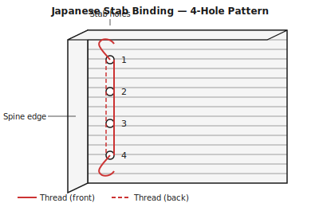
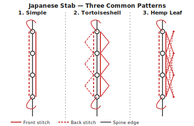

## What is Japanese stab binding? {#overview}

Japanese stab binding (和綴じ, *watatoji*) sews a flat stack of single pages together by piercing through holes near the spine edge and wrapping thread in a decorative pattern visible on both the front and back covers.

Unlike most Western bindings, the pages are not folded — each sheet is a single leaf. The book does not open completely flat, but the binding is fast, beautiful, and one of the most accessible hand-binding techniques.

## When to use this technique {#when-to-use}

Japanese stab binding is ideal for:

- Notebooks, journals, and poetry collections where craft and appearance are as important as function
- Short to medium documents (up to about 80–100 pages)
- Gifts and handmade publications
- Beginners learning their first decorative stitch

It is not suitable when the book needs to open flat, or when the documents are long (the pages cannot open past a slight angle and the binding stiffens with thickness).

## Tools and materials {#tools-materials}

1. An **awl or Japanese screw punch** — the screw punch is much easier for piercing through a thick stack cleanly.
2. A **bookbinding needle** with a large eye.
3. **Waxed linen thread** for a traditional look. Silk thread or decorative cord adds colour; wax the thread if it is not pre-waxed.
4. A **bone folder** for neat, aligned edges.
5. **Binder's clips** to clamp the page stack firmly while piercing.
6. **Cover card stock** at 200–350 gsm. Decorative paper, fabric-covered board, or printed card all work well.

## Preparing your pages in Quire {#preparation}

1. Open your PDF and select **Japanese stab** as the binding technique.
2. Japanese stab binding uses single-leaf pages — no imposition or folding. Quire will arrange pages in reading order, single-up.
3. Confirm the **binding edge**: left for LTR, right for RTL.
4. Quire applies a wider spine margin (typically 15–20 mm) to keep content clear of the sewing holes.
5. Check your page count is even if printing double-sided.
6. Export the PDF.

## Printing and assembling {#printing}

Print single-sided (each leaf carries one page) or double-sided (each leaf carries two pages, front and back). For notes and journals, single-sided is common.

Collate all pages in order. Add the front and back cover. Square the stack carefully and clamp with binder's clips 30 mm from the fore-edge while working on the spine.

## Marking and piercing the holes {#piercing}

Mark the hole positions on a strip of scrap paper that matches the book height — this is your template. Classic 4-hole stab binding uses holes at these positions:

- 15 mm from the head
- 15 mm from the tail
- Two evenly spaced holes between

Use the same template for every book you make to ensure consistency. Transfer the marks to the spine edge of the clamped stack.

Pierce through the full stack at each hole with an awl or screw punch. Work slowly and keep the tool perpendicular to the page surface.

## Sewing the stitch patterns {#sewing}

Cut a length of thread roughly four times the book height. Thread your needle.

**Four-hole stab (basic pattern):**

1. Insert the needle at hole 2 from the back, leaving a tail at the back.
2. Wrap around the head edge and re-enter hole 1 from the front.
3. Come out at hole 1 from the back. Wrap around the head edge and re-enter hole 1 from the front again. (This wraps the head.)
4. Continue from hole 1 to hole 2 along the front face.
5. At hole 2 go through to the back. Advance along the back to hole 3. Go through to the front.
6. Advance along the front to hole 4. Go through to the back. Wrap around the tail and re-enter hole 4. (This wraps the tail.)
7. Advance back along the spine in reverse — holes 4 → 3 → 2 → 1 — filling the gaps left by the first pass.
8. Tie off at hole 2 (where the tail is), tying the two ends together with a square knot inside hole 2.

**Hemp-leaf pattern (asa-no-ha):**

The hemp-leaf pattern adds diagonal stitches linking the main holes. See the stitch diagram above. Work the four-hole base pattern first, then add diagonal passes connecting hole 1 to hole 3 and hole 2 to hole 4, wrapping each at head and tail.

## Tips and variations {#tips}

> **Tip:** Use contrasting thread for maximum visual impact. The entire sewing pattern is visible on both covers — it is part of the finished design.

> **Tip:** A screw punch produces much cleaner holes through thick stacks than an awl. If you bind regularly, the investment is worthwhile.

> **Tip:** For an RTL book, pierce holes from the right edge and work right to left. The stitch pattern is the same; only the orientation changes.

> **Warning:** Do not force the thread through misaligned holes. If the needle resists, re-pierce the hole rather than tearing through the paper.

> **Warning:** Japanese stab binding is not suitable for books thicker than about 10 mm (roughly 80–100 pages of 80 gsm paper). The pages cannot open past a slight angle and the binding becomes very stiff.
