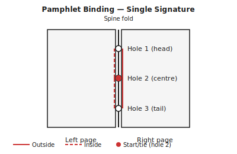

## What is pamphlet stitch? {#overview}

Pamphlet stitch is the simplest sewn binding: a single folded sheet (or a single signature of nested sheets) sewn together with three holes along the spine fold. The result is a clean, flat booklet that lies completely flat when open.

It is the ancestor of most Western sewn bindings. You can bind a small zine, a program, or a few-page document in under thirty minutes with nothing more than a needle, thread, and an awl.

## When to use this technique {#when-to-use}

Pamphlet stitch is ideal for:

- Very short documents (4–16 pages)
- Zines, programs, menus, and small reference cards
- Projects where speed matters more than durability
- Teaching beginners to sew

For longer documents, use **saddle stitch** (multiple nested signatures) or **sewn signatures** (independently sewn signatures assembled into a book block).

## Tools and materials {#tools-materials}

You need very little:

1. An **awl or bookbinding needle** to pierce the sewing holes.
2. A **bone folder** for a crisp, accurate fold.
3. A **ruler and pencil** to mark hole positions.
4. A **cutting mat** to protect your work surface.
5. A **needle and waxed linen thread** — waxed thread glides easily and knots securely.

For the cover: a sheet of card stock at 120–200 gsm adds body and protects the pages.

## Preparing your pages in Quire {#preparation}

1. Open your PDF in Quire and select **Pamphlet** as the binding technique.
2. Quire will check that your page count is a multiple of 4. Add filler pages if needed.
3. Add a cover sheet at the front if desired.
4. Select your paper size and export the imposed PDF.

## Printing and folding {#printing}

Print the imposed PDF double-sided, with **flip on short edge** selected.

To fold:

1. Collect the sheets in order.
2. Fold all sheets together in one action, aligning the edges.
3. Run your bone folder along the fold from the centre outward.

## Sewing the pamphlet {#binding}

1. Open the folded booklet to the centre spread.
2. Mark three hole positions on the spine fold: one in the centre, one 20 mm from the top, and one 20 mm from the bottom.
3. Pierce all layers at each mark with an awl.
4. Cut a length of waxed linen thread roughly three times the height of the spine.
5. Thread your needle. Begin at the centre hole, pushing the needle **out** through the spine.
6. Carry the needle to the top hole and push it **in** through the centre fold.
7. Carry the needle back out through the spine at the bottom hole.
8. Finally, pass the needle back **in** through the centre hole.
9. The thread now loops around the spine with a long stitch on the outside. Tie off the two tail ends at the centre hole with a square knot, ensuring the long outside stitch lies on one side of the knot tails.

## Tips and variations {#tips}

> **Tip:** Use contrasting thread colour for a decorative effect — the long stitch on the outside of the spine is clearly visible on a pamphlet.

> **Tip:** For a stronger result, wax your thread by pulling it across a block of beeswax before sewing. The wax reduces friction and the thread grips tighter after knotting.

> **Tip:** Five holes instead of three makes the binding more secure for thicker signatures. Space holes evenly with the outer two 20 mm from head and tail.

> **Warning:** Pamphlet stitch is only suitable for thin signatures (up to about 16 pages). For thicker documents, switch to saddle stitch or sewn signatures.
