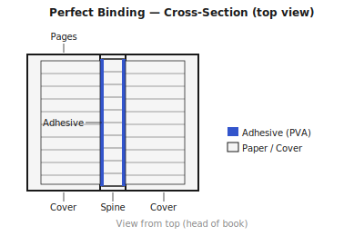

## What is perfect binding? {#overview}

Perfect binding produces the flat, square spine familiar from most modern paperback books. Individual pages (or very thin groups of pages) are gathered into a book block, the spine edges are roughened, and adhesive is applied to bond them together and to the wrap-around cover.

The name is slightly ironic — perfect binding is actually the weakest of the common book constructions and relies entirely on the adhesive bond. Pages can detach if the wrong glue is used or if the book is opened too forcefully.

## When to use this technique {#when-to-use}

Perfect binding works well for:

- Paperback books and trade publications of 64 pages or more
- Documents where a flat, labelled spine is important
- High-volume production (commercial perfect binding is fast and cheap)
- Documents not expected to last more than a few years of normal use

For long-lasting books, sewn signatures or case binding is a much more durable choice.

## Tools and materials {#tools-materials}

1. A **guillotine or sharp craft knife** — the spine must be cut perfectly square before gluing.
2. **Coarse sandpaper (80–120 grit)** or a wire brush for roughening the spine to improve glue adhesion.
3. **Flexible PVA bookbinding glue** — standard white PVA dries brittle. Use a flexible formulation (sometimes sold as bookbinding PVA or EVA-based glue). Alternatively, use a hot-melt glue gun with binding-grade adhesive.
4. A **brush** for applying PVA evenly across the spine.
5. **Clamps or a press** to hold the book block upright and square while the glue dries.
6. **Mull or a kraft paper strip** as a spine liner: applied over the first coat of glue, it bridges any gaps and adds tensile strength.
7. **Cover card stock** at 250–350 gsm, scored and folded to form front cover, spine panel, and back cover in one piece.

## Preparing your pages in Quire {#preparation}

1. Open your PDF and select **Perfect binding** as the binding technique.
2. Perfect binding requires no imposition — each page prints as a full single-sided or double-sided leaf. Quire will impose pages in reading order, single-up.
3. Quire checks that the page count is even (for double-sided printing). Add a blank page if needed.
4. Configure the **spine width** if you are generating a cover template. Quire will calculate spine width from page count and paper weight.
5. Export the text block PDF and (optionally) the cover template PDF.

## Printing the text block {#printing}

Print double-sided with **flip on long edge** (portrait orientation, standard duplex).

Collate the pages in reading order. Square the stack carefully — the spine edge must be perfectly even. Press under a weight for at least 30 minutes before trimming.

## Preparing the spine {#spine-prep}

1. Clamp the book block in a press or between two boards with the spine edge protruding 5 mm.
2. Trim the spine with a guillotine to ensure it is perfectly flat and square.
3. Score the spine surface with coarse sandpaper (80–120 grit), working back and forth along the spine. You want a lightly textured surface, not deeply grooved.
4. If using PVA: apply a thin first coat to the spine with a brush. Work it into the scored surface. Let dry 15–20 minutes until just tacky.

## Gluing the book block {#gluing}

1. Apply a generous second coat of flexible PVA to the spine.
2. While wet, press a strip of mull or kraft paper onto the spine, slightly narrower than the book height. Smooth out any bubbles.
3. Apply a third thin coat of PVA over the liner. Let cure for at least one hour.
4. The result should be a firm, slightly flexible spine that does not crack when gently flexed.

## Attaching the cover {#cover}

1. Score and fold the cover stock to match the spine width exactly. The fold lines define the front cover / spine / back cover panels.
2. Apply a thin, even coat of PVA to the spine panel of the cover.
3. Press the book block spine-first onto the cover spine panel, aligning head and tail.
4. Wrap the front and back cover panels around and clamp flat under pressing boards.
5. Let cure fully — at least two hours, overnight is safer.
6. Trim the three open edges (head, tail, fore-edge) with a guillotine for a clean finish.

## Tips and common mistakes {#tips}

> **Tip:** Use flexible PVA, not standard white PVA. Books bound with standard PVA become brittle within a year and pages begin to detach.

> **Tip:** Sandpaper the spine generously. The surface roughness is what the adhesive grips. An unscored spine will fail faster.

> **Tip:** The spine width on your cover must match the book block spine exactly. Measure after gluing (the spine liner adds a little thickness). Print your cover only after the book block is assembled and measured.

> **Warning:** Do not open a freshly glued perfect-bound book flat to 180°. The adhesive needs 24 hours to reach full strength. Opening flat before the glue is cured will crack the spine permanently.

> **Warning:** Perfect binding is not suitable for books that will be heavily used or need to last more than a few years. For durability, use sewn signatures.
