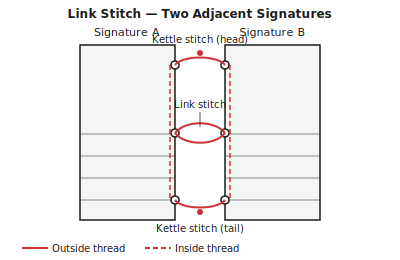

## What is sewn signatures binding? {#overview}

Sewn signatures binding assembles a book from multiple independently folded sections called signatures. Each signature is a small group of nested folded sheets (typically 4–8 sheets, giving 16–32 pages). The signatures are sewn together at the spine using a link stitch that locks each new signature to the previous one.

The resulting book block is extremely durable and opens flat. It is the structural basis for nearly all traditionally bound books — paperback or hardcover.

## When to use this technique {#when-to-use}

Sewn signatures are the right choice for:

- Documents of 64 pages or more
- Books intended to last — sewn bindings far outlast glued ones
- Any book you want to open completely flat
- Hardcover projects (sewn signatures are the book block for case binding)

For very short documents (under 64 pages), saddle stitch or booklet binding is simpler.

## Tools and materials {#tools-materials}

1. An **awl** for piercing the sewing holes through the spine fold of each signature.
2. A **bookbinding needle** — blunt-tipped with a large eye to carry thick thread.
3. A **bone folder** for sharp, even folds.
4. A **sewing frame or clamp** (optional) to hold the book block steady while sewing.
5. **Waxed linen thread** — 18/3 or 25/3 weight for most books. Wax your thread by drawing it over beeswax to reduce friction and improve knot grip.
6. **PVA glue** and a brush, for consolidating the spine after sewing.
7. **Mull or super** — a loose-woven fabric glued to the spine to reinforce it.

## Preparing your pages in Quire {#preparation}

1. Open your PDF and select **Sewn signatures** as the binding technique.
2. Set the **signature size** — the number of sheets per signature. Four sheets (16 pages) is a reliable starting point. Thicker paper warrants fewer sheets per signature.
3. Quire will calculate how many signatures you will have and add completion blanks to fill the last signature if needed.
4. Set the paper thickness (gsm or mm) to enable creep compensation. Quire will shift the outer pages of each signature outward so the fore-edges align after trimming.
5. Export the imposed PDF.

## Printing and folding signatures {#printing}

Print double-sided with **flip on short edge**.

After printing:

1. Sort the sheets into signature groups (Quire's imposition marks each group).
2. Fold each signature individually. Fold all sheets of a signature together, aligning edges, and bone-fold firmly.
3. Nest each folded group into its signature and press flat.
4. Stack the signatures in order and press under a weight overnight if time allows.

## Sewing the signatures {#sewing}

Mark sewing holes on each signature using a template (a strip of card the height of the spine with holes marked in pencil — use the same template for every signature so holes align).

Pierce each signature separately with an awl.

**Sewing order:**

1. Open the first signature at the centre spread. Sew through the holes from the inside, leaving a tail at the first hole.
2. Add the second signature on top of the first. Sew through matching holes, looping the thread around the link stitch from the previous signature (the kettle stitch at head and tail).
3. Continue adding signatures one by one, linking each to the previous at every hole.
4. At the end of each signature, tie a half-hitch before moving to the next.
5. Finish with a kettle stitch knot at the tail.

## Finishing the book block {#finishing}

1. Press the sewn book block firmly under a weight or in a press for at least one hour.
2. Apply a thin coat of PVA to the spine and work it in with your fingers. Let dry.
3. Cut a strip of mull or super slightly shorter than the book height. Apply PVA to the spine and press the mull on, allowing it to overhang each side by 20–30 mm. Let dry fully.
4. Trim the head and tail of the book block if needed with a sharp knife or guillotine.

The finished book block is ready to receive a softcover or case binding.

## Tips and common mistakes {#tips}

> **Tip:** Wax your thread generously. Unwaxed thread tangles, stretches, and is harder to pull taut without cutting into the paper.

> **Tip:** Keep your sewing tension consistent throughout. Loose sewing leads to a wobbly spine; very tight sewing can tear the paper. Aim for firm but not strained.

> **Tip:** Always press the book block after sewing. The compression consolidates the signatures and makes the spine firm and flat.

> **Warning:** Do not skip the mull reinforcement step if you plan to case-bind the book block. Without mull, the only structural connection between the book block and the boards is the pastedown — the book will fail quickly with heavy use.

> **Warning:** If your last signature is significantly thinner than the others (because completion blanks were added), the book block will be noticeably uneven at the spine. Use Quire's padding controls to distribute blanks across the book rather than concentrating them in one signature.
