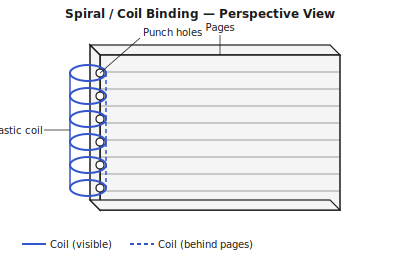

## What is spiral binding? {#overview}

Spiral binding (also called coil binding) threads a continuous plastic or metal coil through a row of punched holes along the spine edge of the page stack. The coil holds all pages and covers together while allowing the book to open fully flat and even fold back on itself.

Plastic coil is the most common variant — flexible, available in many colours, and easy to work with using a desktop machine. Wire-O (double-loop wire) is the professional variant, with a cleaner look and slightly more rigid feel.

## When to use this technique {#when-to-use}

Spiral binding is ideal for:

- Notebooks, planners, calendars, and workbooks
- Documents that need to lie completely flat or fold back 360°
- Manuals and reference documents that stay open at one page
- Presentations and reports where a neat, professional finish is wanted quickly

It is not suitable when documents are expected to be frequently updated (you cannot easily add or remove pages from a coil-bound book) or when the binding must be archive-quality.

## Tools and materials {#tools-materials}

1. A **spiral binding machine** — desktop machines combine a multi-hole punch with a coil-insertion slot. Manual machines are affordable and widely available.
2. A **plastic coil** sized to match the book thickness. Coil diameter is measured in millimetres; choose a size that allows pages to turn easily without slipping. A general rule: coil diameter ≈ book thickness + 5 mm.
3. A **coil crimping tool** — typically built into binding machines — to close the coil ends and prevent it from backing out.
4. **Cover card stock** at 200–350 gsm. A transparent PVC front cover (150–200 micron) gives a professional look and protects the first page.

## Preparing your pages in Quire {#preparation}

1. Open your PDF and select **Spiral** as the binding technique.
2. Spiral binding requires no imposition — pages print one-up in reading order.
3. Quire checks page count and adds a blank final page if needed for even printing.
4. Confirm the **binding edge**: left edge for LTR, right edge for RTL, or top edge for landscape-format calendars and notepads.
5. Quire applies the appropriate margin adjustment to keep content clear of the punch holes (typically 10–12 mm on the binding edge).
6. Export the PDF.

## Printing your pages {#printing}

Print single-sided or double-sided depending on whether you want a notebook (single-sided) or a two-sided document. For double-sided spiral binding, use **flip on long edge** for portrait orientation.

Collate and square the page stack. Include the front and back covers.

## Punching the holes {#punching}

1. Load the punching machine with the correct die for your coil pitch. Most plastic coils use a 4:1 pitch (4 holes per inch) or 3:1 pitch (3 holes per inch). Match the die to the coil.
2. Punch the covers first to verify alignment, then punch the text pages in small batches (most desktop machines handle 10–15 sheets at once).
3. Align the spine edge of each batch carefully against the machine's backstop for consistent hole position.
4. For RTL binding, punch from the right edge.

## Inserting the coil {#binding}

1. Cut the coil to the book height plus about 10 mm.
2. Insert one end of the coil into the first hole and rotate it through all holes continuously. A machine insertion slot makes this much easier; without one, use your fingers to guide the coil through hole by hole.
3. Once the coil extends past the last hole on both ends, trim any excess so the coil protrudes about 5 mm beyond each end.
4. Crimp both ends with the crimping tool (or flat-nose pliers) to prevent the coil from backing out.

## Tips and common mistakes {#tips}

> **Tip:** Choose the correct coil size. A coil that is too small will be difficult to insert and will hold pages too tightly; a coil that is too large will allow pages to fall out. Use the book thickness + 5 mm rule as a starting point.

> **Tip:** Punch in small batches. Overfilling the punch produces ragged holes that weaken the binding and make coil insertion harder.

> **Tip:** For a calendar or notepad (top-bound), rotate all pages 90° in Quire before exporting so the content is in landscape orientation. Quire's spiral binding mode supports top-edge punching for this format.

> **Warning:** Do not punch too close to the page edge. The holes need at least 5 mm of paper margin beyond the hole to avoid tearing. Check the margin setting in Quire before exporting.

> **Warning:** Plastic coils are not archival. For documents intended to last decades, choose sewn signatures or case binding.
